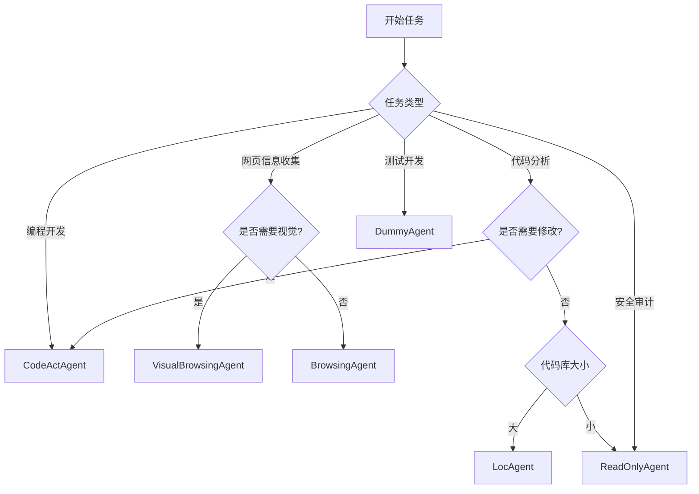

# OpenHands Agent使用场景指南

## 📋 概览

OpenHands提供了多个专业化的智能体，每个agent针对特定任务场景设计。本指南详细介绍各agent的使用场景、功能特点和选择建议。

## 🤖 Agent分类与使用场景

### 1. **CodeActAgent** - 全能代码助手

#### **核心定位**
- **默认agent**，适用于90%的编程任务
- 基于CodeAct框架，统一代码动作空间
- 支持完整的开发工作流

#### **适用场景**
- ✅ **代码开发**：编写、调试、重构代码
- ✅ **项目管理**：初始化项目、配置环境
- ✅ **问题修复**：Bug定位、性能优化
- ✅ **文档编写**：生成README、API文档
- ✅ **测试开发**：单元测试、集成测试

#### **核心工具**
| 工具名称 | 功能描述 | 使用示例 |
|---------|----------|----------|
| `execute_bash` | 执行Linux命令 | `ls -la`, `git status` |
| `execute_ipython_cell` | 运行Python代码 | 数据分析、算法验证 |
| `str_replace_editor` | 文件编辑 | 代码修改、配置更新 |
| `browser` | 网页交互 | 文档查阅、API测试 |
| `web_read` | 读取网页内容 | 获取技术文档 |

#### **使用建议**
```bash
# 默认使用CodeActAgent
poetry run python -m openhands.core.main \
  -t "创建一个Python Web应用" \
  -m gpt-4o
```

---

### 2. **BrowsingAgent** - 专业网页浏览

#### **核心定位**
- 专门用于网页浏览和信息检索
- 基于BrowserGym框架
- 支持复杂网页交互

#### **适用场景**
- ✅ **信息收集**：搜索技术资料、新闻
- ✅ **数据抓取**：提取网页信息
- ✅ **在线测试**：测试Web应用功能
- ✅ **竞品分析**：研究竞争对手产品

#### **使用建议**
```bash
# 使用BrowsingAgent进行网页任务
poetry run python -m openhands.core.main \
  -c BrowsingAgent \
  -t "在GitHub上搜索OpenHands项目的star数量" \
  -m claude-3-5-sonnet-20241022
```

#### **注意事项**
- 建议使用**GPT-4/Claude**等高级模型
- 复杂网页结构需要更强的理解能力

---

### 3. **VisualBrowsingAgent** - 视觉化网页浏览

#### **核心定位**
- 支持视觉理解的网页浏览
- 基于AgentLab框架
- 处理截图和可访问性树

#### **适用场景**
- ✅ **视觉测试**：检查网页布局和样式
- ✅ **UI交互**：点击按钮、填写表单
- ✅ **截图分析**：理解复杂的可视化界面
- ✅ **无障碍测试**：验证可访问性

#### **特点**
- 支持**set-of-marks**标注的网页截图
- 包含完整的可访问性树信息
- 适用于**VisualWebArena**评测

---

### 4. **LocAgent** - 代码定位专家

#### **核心定位**
- 基于图结构的代码定位
- 专为大规模代码库设计
- 支持多跳推理

#### **适用场景**
- ✅ **代码理解**：快速理解大型代码库结构
- ✅ **依赖分析**：追踪函数/类的调用关系
- ✅ **重构规划**：识别影响范围
- ✅ **Bug定位**：精确定位问题代码位置

#### **核心工具**
| 工具名称 | 功能描述 |
|---------|----------|
| `search_code_snippets` | 搜索代码片段 |
| `get_entity_contents` | 获取实体内容 |
| `explore_tree_structure` | 探索代码树结构 |

#### **使用建议**
```bash
# 用于代码库分析
poetry run python -m openhands.core.main \
  -c LocAgent \
  -t "分析这个Python项目的架构" \
  -m gpt-4o
```

---

### 5. **ReadOnlyAgent** - 只读代码分析

#### **核心定位**
- **安全模式**下的代码分析
- 只读操作，不修改任何文件
- 适用于审计和安全检查

#### **适用场景**
- ✅ **代码审计**：安全审查、合规检查
- ✅ **架构分析**：理解代码结构而不修改
- ✅ **文档生成**：从代码生成文档
- ✅ **代码审查**：PR/MR审查支持

#### **核心工具**
| 工具名称 | 功能描述 |
|---------|----------|
| `view` | 查看文件内容 |
| `glob` | 文件模式匹配 |
| `grep` | 内容搜索 |

#### **使用场景**
- **生产环境**代码审查
- **第三方代码**安全分析
- **学习目的**代码理解

---

### 6. **DummyAgent** - 测试代理

#### **核心定位**
- 最小功能代理实现
- 用于测试和演示
- 学习agent开发的起点

#### **适用场景**
- ✅ **开发测试**：验证agent框架
- ✅ **教学演示**：理解agent工作原理
- ✅ **基准测试**：性能基准对比

---

## 🎯 Agent选择决策树



## 📊 性能对比

| Agent | 主要用途 | 推荐模型 | 速度 | 复杂度 |
|-------|----------|----------|------|--------|
| CodeActAgent | 通用开发 | GPT-4o/Claude-3.5 | ⭐⭐⭐ | ⭐⭐⭐⭐ |
| BrowsingAgent | 网页浏览 | GPT-4/Claude-3.5 | ⭐⭐ | ⭐⭐⭐⭐ |
| VisualBrowsingAgent | 视觉浏览 | GPT-4V/Claude-3.5 | ⭐ | ⭐⭐⭐⭐⭐ |
| LocAgent | 代码定位 | GPT-4o | ⭐⭐⭐ | ⭐⭐⭐ |
| ReadOnlyAgent | 只读分析 | GPT-3.5/4o | ⭐⭐⭐⭐ | ⭐⭐ |
| DummyAgent | 测试 | 任意 | ⭐⭐⭐⭐⭐ | ⭐ |

## 🚀 快速开始示例

### **场景1：Web开发**
```bash
# 创建React应用
poetry run python -m openhands.core.main \
  -t "创建一个React + TypeScript的待办事项应用" \
  -m gpt-4o
```

### **场景2：数据分析**
```bash
# 分析CSV数据
poetry run python -m openhands.core.main \
  -t "分析data.csv文件，生成数据报告和可视化图表" \
  -m claude-3-5-sonnet-20241022
```

### **场景3：网页信息收集**
```bash
# 收集技术资料
poetry run python -m openhands.core.main \
  -c BrowsingAgent \
  -t "搜索最新的Python异步编程最佳实践" \
  -m gpt-4o
```

### **场景4：代码审计**
```bash
# 安全代码审查
poetry run python -m openhands.core.main \
  -c ReadOnlyAgent \
  -t "审查这个Python项目的安全漏洞" \
  -m gpt-4o
```

## 🔧 配置建议

### **CodeActAgent优化配置**
```toml
[agent]
enable_browsing = true
enable_jupyter = true
enable_llm_editor = true
enable_cmd = true

[llm]
model = "gpt-4o"
temperature = 0.0
```

### **BrowsingAgent优化配置**
```toml
[agent]
enable_browsing = true
enable_jupyter = false
enable_llm_editor = false

[llm]
model = "claude-3-5-sonnet-20241022"
temperature = 0.1
```

## 📈 选择建议

| 任务场景 | 推荐Agent | 理由 |
|---------|-----------|------|
| **新项目开发** | CodeActAgent | 全能工具支持 |
| **Bug修复** | CodeActAgent | 调试工具完整 |
| **网页爬虫** | BrowsingAgent | 专业网页处理 |
| **代码审查** | ReadOnlyAgent | 安全只读模式 |
| **大型项目理解** | LocAgent | 图结构分析 |
| **UI测试** | VisualBrowsingAgent | 视觉化处理 |
| **学习测试** | DummyAgent | 简单易懂 |

## 📝 总结

- **90%场景**：使用**CodeActAgent**（默认）
- **网页任务**：使用**BrowsingAgent**或**VisualBrowsingAgent**
- **安全场景**：使用**ReadOnlyAgent**
- **大型代码库**：使用**LocAgent**
- **开发测试**：使用**DummyAgent**

选择合适的agent可以显著提升任务完成效率和质量！