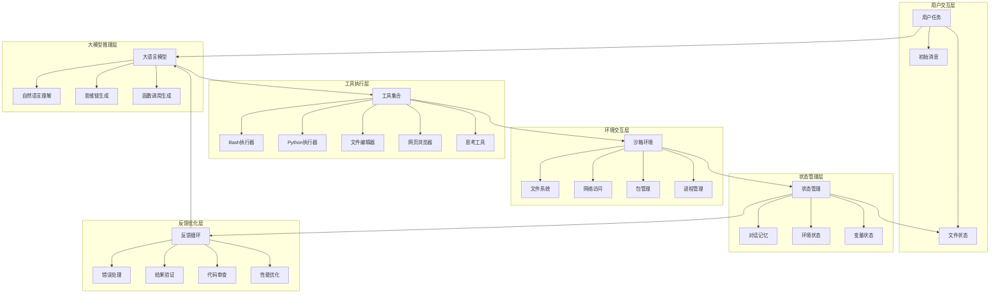
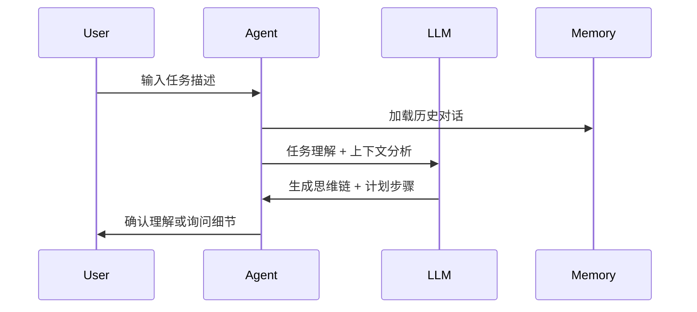
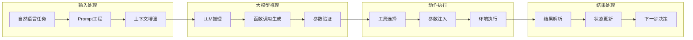
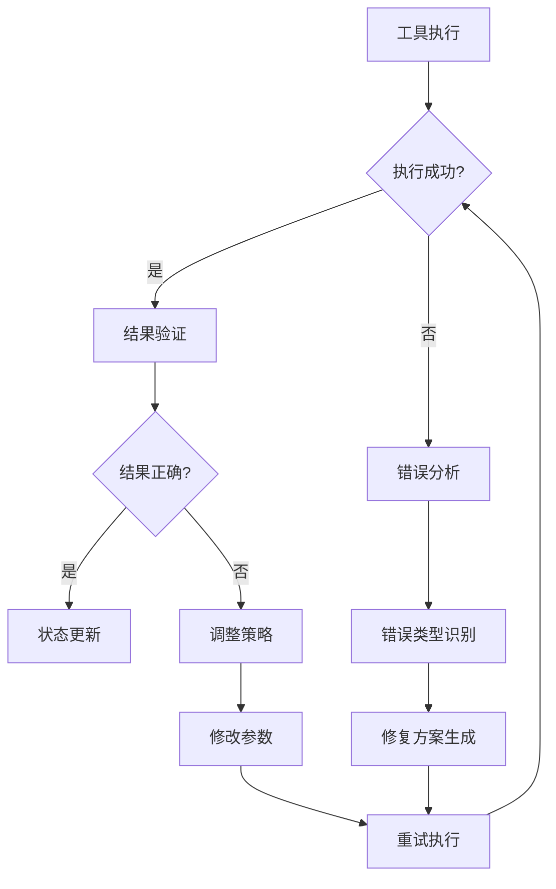
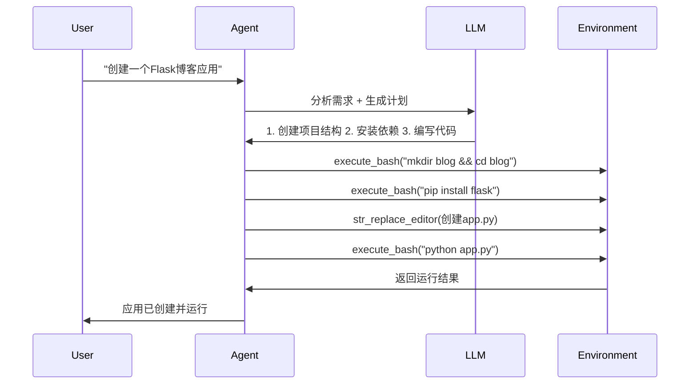
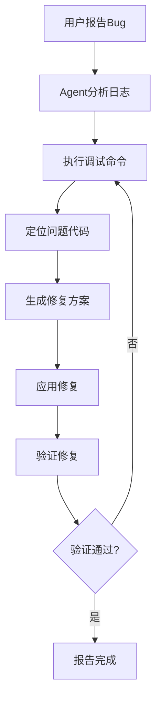

# CodeActAgent 通用开发能力架构详解

## 🎯 架构概览

CodeActAgent通过**统一代码动作空间**将大模型的自然语言理解能力转化为通用开发能力，实现了**思考-行动-观察**的完整闭环。



## 🔄 核心工作流程

### **阶段1：任务解析与理解**



### **阶段2：代码动作生成**



## 🛠️ 工具生态系统

### **1. 代码执行工具**

#### **Bash执行器**
```python
# 能力映射
自然语言: "列出当前目录文件"
↓ 转换 ↓
函数调用: execute_bash(command="ls -la")
↓ 执行 ↓
结果: 文件列表 + 详细信息
```

#### **Python执行器**
```python
# 能力映射
自然语言: "计算斐波那契数列"
↓ 转换 ↓
函数调用: execute_ipython_cell(code="def fib(n):...")
↓ 执行 ↓
结果: 算法实现 + 运行结果
```

### **2. 文件操作工具**

#### **字符串替换编辑器**
```python
# 能力映射
自然语言: "在第10行添加日志打印"
↓ 转换 ↓
函数调用: str_replace_editor(
    command="str_replace",
    path="main.py",
    old_str="print('hello')",
    new_str="print('hello'); logger.info('added')"
)
```

#### **LLM文件编辑器**
```python
# 能力映射
自然语言: "重构这个函数使其更高效"
↓ 转换 ↓
函数调用: edit_file(
    path="utils.py",
    instructions="优化算法复杂度"
)
```

### **3. 网络工具**

#### **网页浏览器**
```python
# 能力映射
自然语言: "搜索Python最佳实践"
↓ 转换 ↓
函数调用: browser(
    action="goto",
    url="https://google.com/search?q=python+best+practices"
)
```

## 🧠 大模型集成架构

### **Prompt工程框架**

```python
# 系统提示模板
SYSTEM_PROMPT = """
你是一个AI编程助手，可以帮助用户完成各种开发任务。

可用工具：
- execute_bash: 执行Linux命令
- execute_ipython_cell: 运行Python代码
- str_replace_editor: 编辑文件
- browser: 浏览网页
- think: 思考步骤

执行原则：
1. 先理解需求，再执行操作
2. 分步骤完成任务
3. 验证每个步骤的结果
4. 遇到错误及时调整
"""
```

### **函数调用协议**

```typescript
interface ToolCall {
    name: string;        // 工具名称
    arguments: object;   // 参数对象
    id: string;         // 调用ID
}

interface ToolResponse {
    content: string;    // 执行结果
    error?: string;     // 错误信息
    metadata?: object;  // 元数据
}
```

## 🔄 反馈循环机制

### **错误处理流程**



### **自适应学习**

1. **模式识别**：从历史执行中学习最佳实践
2. **参数优化**：根据环境反馈调整执行参数
3. **策略改进**：基于成功率优化执行策略

## 📊 能力矩阵

### **支持的开发任务**

| 任务类型 | 支持度 | 关键工具 | 示例场景 |
|----------|---------|----------|----------|
| **代码生成** | ⭐⭐⭐⭐⭐ | IPython + 文件编辑 | 创建完整应用 |
| **调试排错** | ⭐⭐⭐⭐⭐ | Bash + Python调试 | 运行时错误修复 |
| **依赖管理** | ⭐⭐⭐⭐ | Bash包管理 | pip/npm安装 |
| **测试开发** | ⭐⭐⭐⭐ | Python测试框架 | 单元测试编写 |
| **文档生成** | ⭐⭐⭐⭐ | 文件编辑 + LLM | API文档创建 |
| **部署配置** | ⭐⭐⭐⭐ | Bash脚本 + 文件编辑 | Docker配置 |
| **网络集成** | ⭐⭐⭐ | 浏览器工具 | API集成测试 |

### **技术栈支持**

```yaml
编程语言:
  - Python: 完整支持
  - JavaScript/TypeScript: 通过Node.js支持
  - Shell: Bash脚本支持
  - 其他: 通过编译器/解释器支持

开发工具:
  - Git: 版本控制
  - Docker: 容器化
  - Makefile: 构建系统
  - 测试框架: pytest, unittest

环境管理:
  - 虚拟环境: venv, conda
  - 包管理: pip, npm, apt
  - 系统工具: 完整Linux环境
```

## 🔍 架构优势

### **1. 统一接口**
- 所有操作通过标准化函数调用实现
- 自然语言到代码动作的无缝转换

### **2. 状态持久化**
- 完整的会话状态保存与恢复
- 跨会话的上下文保持

### **3. 环境隔离**
- 安全的沙箱执行环境
- 可重现的运行时状态

### **4. 可扩展性**
- 模块化工具设计
- 易于添加新功能

## 🚀 实际应用示例

### **场景1：创建Python Web应用**



### **场景2：调试复杂问题**



## 🔮 未来扩展方向

### **即将支持**
- 更多编程语言支持（Java, Go, Rust）
- 云原生开发工具
- 机器学习工作流
- 微服务架构支持

### **技术演进**
- 多模态理解（图像+代码）
- 强化学习优化
- 个性化开发风格
- 团队协作功能

---

## 📋 总结

CodeActAgent通过**三层架构**实现了通用开发能力：

1. **思考层**：大模型理解需求，生成执行计划
2. **工具层**：标准化函数调用，统一操作接口  
3. **执行层**：沙箱环境，安全可靠的代码执行

这种架构使得**自然语言到完整开发工作流**的转换成为可能，真正实现了"说人话，做实事"的AI编程助手愿景。