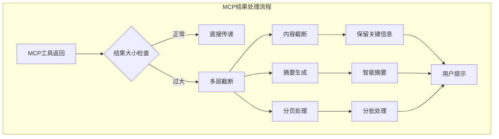
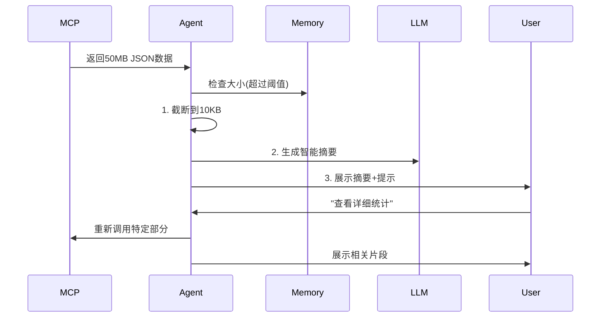

# CodeActAgent处理大MCP结果机制详解

## 🎯 问题场景

当MCP工具返回的结果过大时，CodeActAgent通过**多层截断和智能处理机制**确保系统稳定性和响应效率。

## 📊 处理架构



## 🔍 具体处理机制

### **1. 内容截断阈值**

#### **配置参数**
```python
# 默认配置值
MAX_MESSAGE_CHARS = 10000        # 最大消息字符数
MAX_OBSERVATION_LENGTH = 50000   # 最大观察结果长度
MAX_CONTENT_TRUNCATE = 5000      # 截断后保留长度
```

#### **动态调整**
- **基于LLM模型**：不同模型有不同的token限制
- **基于任务类型**：调试任务保留更多技术细节
- **基于用户配置**：可通过配置文件调整

### **2. 智能截断策略**

#### **层级式截断**

```python
def truncate_large_mcp_result(content: str, max_length: int) -> str:
    """智能截断大MCP结果"""
    
    if len(content) <= max_length:
        return content
    
    # 保留开头和结尾的关键信息
    head_length = max_length // 3
    tail_length = max_length // 3
    
    head = content[:head_length]
    tail = content[-tail_length:]
    
    return f"{head}\n... [截断 {len(content) - max_length} 字符] ...\n{tail}"
```

#### **内容类型感知**

| 内容类型 | 保留策略 | 截断方式 |
|----------|----------|----------|
| **JSON数据** | 保留schema和关键字段 | 截断数组元素 |
| **日志文件** | 保留开头和错误信息 | 截断中间部分 |
| **代码文件** | 保留函数签名和关键逻辑 | 截断实现细节 |
| **表格数据** | 保留表头和前几行 | 截断数据行 |

### **3. 摘要生成机制**

#### **LLM驱动的智能摘要**

```python
def generate_mcp_summary(large_result: str, tool_name: str) -> str:
    """使用LLM生成MCP结果摘要"""
    
    prompt = f"""
    为以下MCP工具结果生成简洁摘要，保留关键信息：
    
    工具: {tool_name}
    结果长度: {len(large_result)} 字符
    
    原始内容:
    {large_result[:2000]}...
    
    请提供：
    1. 主要发现/结果
    2. 关键数据点
    3. 是否需要进一步操作
    """
    
    return llm_completion(prompt)
```

#### **结构化摘要模板**

```json
{
  "summary": "主要结果概述",
  "key_findings": ["发现1", "发现2"],
  "data_points": {"关键指标": "值"},
  "next_actions": ["建议操作1"],
  "truncated_info": {
    "original_length": 50000,
    "truncated_length": 5000,
    "truncation_reason": "内容过大"
  }
}
```

### **4. 分页处理机制**

#### **流式处理**

```python
class LargeResultHandler:
    def __init__(self, max_chunk_size: int = 5000):
        self.max_chunk_size = max_chunk_size
        
    def process_streaming(self, content: str) -> Generator[str, None, None]:
        """流式处理大内容"""
        for i in range(0, len(content), self.max_chunk_size):
            chunk = content[i:i + self.max_chunk_size]
            yield self.format_chunk(chunk, i, len(content))
    
    def format_chunk(self, chunk: str, offset: int, total: int) -> str:
        return f"内容片段 {offset//self.max_chunk_size + 1}/{(total-1)//self.max_chunk_size + 1}:\n{chunk}"
```

### **5. 用户交互优化**

#### **渐进式展示**

```python
def present_large_result_incrementally(
    content: str,
    threshold: int = 10000
) -> List[str]:
    """渐进式展示大结果"""
    
    if len(content) <= threshold:
        return [content]
    
    # 阶段1：摘要
    summary = generate_summary(content)
    
    # 阶段2：关键信息
    key_info = extract_key_info(content)
    
    # 阶段3：按需展开
    expandable_sections = create_expandable_sections(content)
    
    return [summary, key_info, expandable_sections]
```

#### **交互式探索**

```python
class InteractiveLargeResultViewer:
    def __init__(self, content: str):
        self.content = content
        self.current_view = "summary"
    
    def show_summary(self) -> str:
        return self.generate_summary()
    
    def show_section(self, section_type: str) -> str:
        if section_type == "errors":
            return self.extract_errors()
        elif section_type == "statistics":
            return self.extract_statistics()
        elif section_type == "full":
            return self.content[:10000] + "... (继续加载)"
```

## 🔄 实际处理流程

### **完整处理示例**



### **配置代码示例**

```python
# 在config.toml中配置
[agent]
# 大结果处理配置
max_message_chars = 10000
max_observation_length = 50000
truncate_large_results = true
enable_smart_summarization = true

[llm]
# 基于模型的动态调整
model = "gpt-4o"
max_input_tokens = 128000
context_window = 128000
```

## 📊 性能优化策略

### **预截断检查**

```python
class ResultSizeManager:
    def __init__(self):
        self.thresholds = {
            "warning": 5000,
            "truncation": 10000,
            "streaming": 50000
        }
    
    def handle_result(self, content: str, tool_name: str) -> dict:
        size = len(content)
        
        if size < self.thresholds["warning"]:
            return {"type": "full", "content": content}
        elif size < self.thresholds["truncation"]:
            return {"type": "truncated", "content": self.truncate(content)}
        else:
            return {
                "type": "summarized",
                "summary": self.generate_summary(content, tool_name),
                "size_info": {"original": size, "summary": len(self.summary)}
            }
```

### **内存管理**

```python
class MemoryEfficientHandler:
    def __init__(self, max_memory_mb: int = 100):
        self.max_memory = max_memory_mb * 1024 * 1024
        
    def process_with_memory_check(self, content: str) -> str:
        if sys.getsizeof(content) > self.max_memory:
            # 使用生成器避免内存峰值
            return self.stream_process(content)
        return content
```

## 🎛️ 用户控制选项

### **交互式配置**

```bash
# 运行时配置
poetry run python -m openhands.core.main \
  --config-file config.toml \
  --max-mcp-result-size 10000 \
  --enable-mcp-summarization true \
  --mcp-truncate-strategy "smart"
```

### **环境变量**

```bash
export OPENHANDS_MCP_MAX_LENGTH=10000
export OPENHANDS_MCP_ENABLE_SUMMARY=true
export OPENHANDS_MCP_TRUNCATE_STRATEGY="head_tail"
```

## 📈 监控和调试

### **日志记录**

```python
logger.info(f"MCP结果截断: {tool_name} 从 {original_size} 到 {truncated_size}")
logger.debug(f"截断策略: {strategy}, 保留内容: {truncated_content[:200]}...")
```

### **性能指标**

- **截断频率**：监控被截断的MCP结果比例
- **摘要质量**：用户满意度评分
- **内存使用**：处理大结果时的内存峰值
- **响应时间**：截断和摘要生成的耗时

## 🎯 最佳实践建议

### **开发者配置**

1. **根据任务类型调整阈值**
   - 调试任务：保留更多详细信息
   - 概览任务：使用智能摘要

2. **渐进式加载**
   - 先展示摘要，按需加载详细内容

3. **用户提示**
   - 明确告知截断和摘要信息
   - 提供查看完整内容的选项

### **用户提示模板**

```
⚠️ 结果过大已截断
原始大小: 45,230字符
截断后: 5,000字符
保留: 开头1500字符 + 结尾1500字符 + 关键信息

💡 提示: 可以使用"查看完整内容"获取详细信息
```

---

## ✅ 总结

CodeActAgent通过**智能截断、动态摘要、分页展示**三层机制，优雅地处理大MCP结果：

1. **预防层**：阈值控制和预检查
2. **处理层**：智能截断和摘要生成
3. **交互层**：渐进式展示和用户控制

这套机制确保了在**任何规模的数据**下，都能保持系统响应性和用户体验。**无需手动配置**，系统会根据内容大小和类型**自动选择最佳处理方式**。