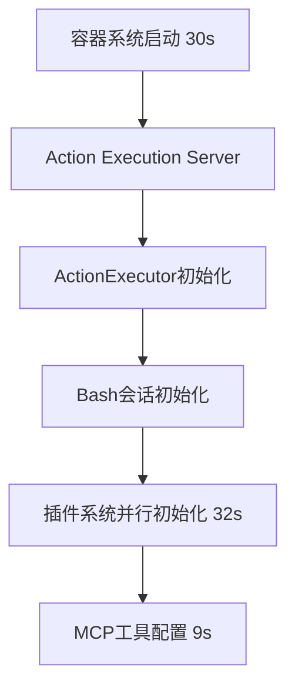
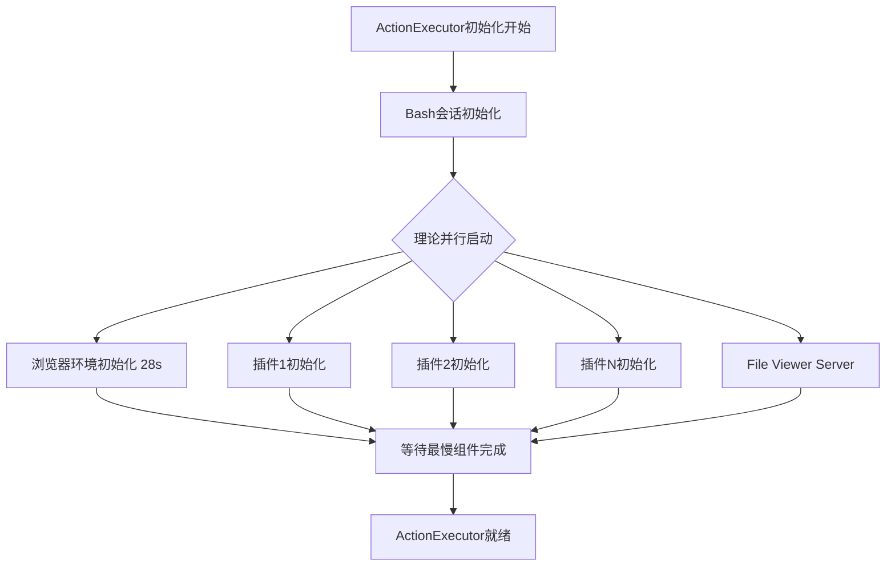
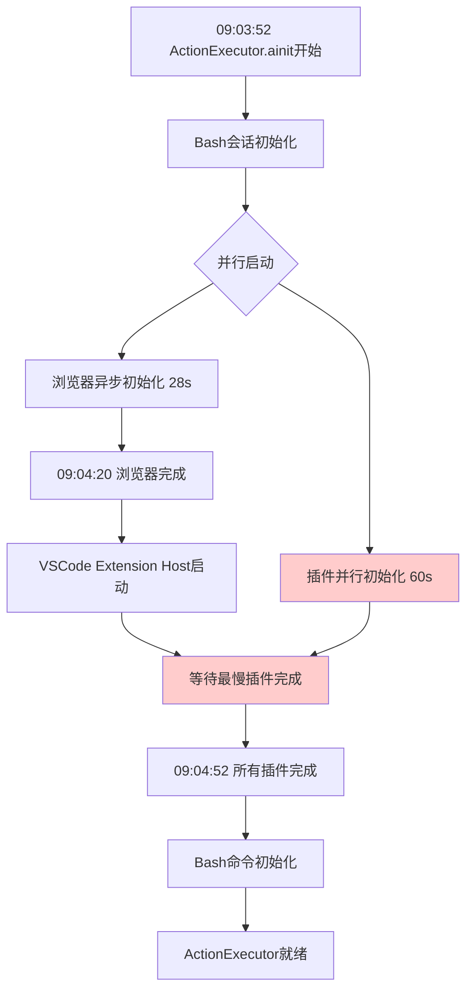

# OpenHands Agent启动性能分析报告

## 概述

基于runtime容器日志分析，总结各个组件的加载时间和依赖关系，用于指导性能优化。

## 时间节点分析

### 主要时间点
- **09:03:22**: 主容器日志 - "Successfully joined conversation"
- **09:03:52**: Runtime容器开始启动 (30秒空白期)
- **09:04:20**: 浏览器环境初始化完成
- **09:04:52**: ActionExecutor初始化完成
- **09:05:01**: MCP工具配置完成

### 详细时间轴

| 时间 | 事件 | 耗时 | 状态 |
|------|------|------|------|
| 09:03:22 | 对话加入成功 | - | 主容器 |
| 09:03:22-09:03:52 | **容器系统启动** | **30秒** | 冷启动期 |
| 09:03:52 | Action Execution Server启动 | 0秒 | 立即 |
| 09:03:52 | File Viewer Server启动 | 0秒 | 立即 |
| 09:03:52 | ActionExecutor.ainit()开始 | 0秒 | 开始 |
| 09:03:52-09:04:52 | **ActionExecutor完整初始化** | **60秒** | 包含以下并行过程: |
| └─ 09:03:52-09:04:20 | 浏览器环境初始化 | 28秒 | 异步并行 |
| └─ 09:03:52-09:04:52 | 插件系统初始化 | 60秒 | 并行但最慢 |
| └─ 09:04:20 | VSCode Extension Host启动 | - | 插件的一部分 |
| └─ 09:04:52 | Bash命令初始化 | <1秒 | 插件完成后执行 |
| 09:04:52 | ActionExecutor初始化完成 | 0秒 | 完成 |
| 09:04:52-09:05:01 | **MCP工具安装配置** | **9秒** | 串行 |
| 09:05:01 | 系统完全就绪 | - | 结束 |

## 组件依赖关系分析

### 强依赖关系 (必须串行)



### 理论并行 vs 实际执行

**理论上的并行组件**:


**实际执行时序** (根据日志和代码分析):


✅ **关键发现**: 
- 浏览器和插件**确实是并行初始化**的
- 浏览器28秒完成，但**某个重型插件需要60秒**
- `wait_all`等待**所有插件完成**，因此总的初始化时间由**最慢的插件**决定
- **不是阻塞关系，而是并行执行中的性能瓶颈**

### 依赖关系详细说明

#### 1. 严格串行依赖
- **容器启动** → **所有其他组件** (系统级依赖)
- **Bash会话** → **所有插件** (插件需要shell环境)
- **ActionExecutor完成** → **MCP工具配置** (需要完整的执行环境)

#### 2. 条件依赖
- **Jupyter插件** → **AgentSkills初始化** (仅当两者都存在时)

#### 3. 完全独立组件
- **浏览器环境** - 异步后台初始化，按需等待
- **File Viewer Server** - 独立的文件服务
- **大部分插件** - 并行初始化，无相互依赖

## 各组件真实加载时间

### 容器级别
| 组件 | 加载时间 | 类型 | 可优化性 |
|------|----------|------|----------|
| 容器系统启动 | 30秒 | 系统级 | 低 (需容器预热) |
| Action Execution Server | 0秒 | 应用级 | - |
| File Viewer Server | 0秒 | 应用级 | - |

### 核心组件
| 组件 | 加载时间 | 类型 | 可优化性 |
|------|----------|------|----------|
| 浏览器环境初始化 | 28秒 | 重型组件 | 中等 (health check优化) |
| 插件系统初始化 | 60秒 | 并行加载 | 🔥高 (识别最慢插件) |
| └─ 最慢插件 | 60秒 | 未知 | 🔥极高 (性能瓶颈) |
| └─ VSCode Extension Host | ~32秒 | 重型插件 | 高 |

### 工具和服务
| 组件 | 加载时间 | 类型 | 可优化性 |
|------|----------|------|----------|
| MCP工具配置 | 9秒 | 网络操作 | 高 (并行化) |
| Bash命令初始化 | <1秒 | 轻量级 | - |

## 性能瓶颈分析

### 主要瓶颈排名

1. **最慢插件 (60秒)** - 🔥最大瓶颈
   - **关键发现**: 某个插件需要60秒完成，拖慢整个初始化
   - 可能是VSCode插件、Jupyter插件或其他重型插件
   - **优化方向**: 
     - 添加插件级性能监控，识别具体的慢插件
     - 对最慢插件进行专项优化
     - 考虑插件懒加载机制

2. **容器冷启动 (30秒)** - 系统瓶颈  
   - Docker容器创建和系统启动
   - **优化方向**: 容器预热池

3. **浏览器环境初始化 (28秒)** - 重型组件
   - multiprocessing + browsergym环境
   - 已经异步并行初始化，不影响总时间
   - **优化方向**: health check超时优化 (次要)

4. **MCP工具配置 (9秒)** - 次要瓶颈
   - 网络下载和安装
   - 当前串行执行
   - **优化方向**: 并行化或预安装

### 并行化现状评估

✅ **已经并行化的组件**:
- 浏览器环境 (异步后台初始化，28秒完成)
- 插件系统 (多插件并行加载，但最慢插件决定总时间)
- File Viewer Server (独立启动)

⚠️ **并行但存在瓶颈**:
- **插件初始化**: 虽然多个插件并行加载，但`wait_all`等待**最慢的插件**
- **瓶颈效应**: 60秒的最慢插件拖慢了整个初始化流程

❌ **仍然串行的组件**:
- 容器启动 (无法避免)
- MCP工具配置 (在ActionExecutor完成后才开始)
- Bash命令初始化 (在插件完成后才开始)

## 优化建议优先级

### 🔥 高优先级 (立即实施)
1. **插件级性能监控** - 🎯核心优化
   ```python
   async def _init_plugin(self, plugin: Plugin):
       start_time = time.time()
       # ... 现有代码 ...
       duration = time.time() - start_time
       logger.info(f'Plugin {plugin.name} initialized in {duration:.2f}s')
   ```
2. **识别60秒最慢插件** - 定位具体的性能瓶颈
3. **最慢插件专项优化** - 针对性能瓶颈进行优化

### 🎯 中优先级 (短期规划) 
1. **插件懒加载机制** - 延迟加载不必要的重型插件
2. **容器预热池** - 解决30秒冷启动问题
3. **MCP工具并行化** - 在插件初始化期间并行安装

### ⚡ 低优先级 (长期优化)
1. **智能组件跳过** - 根据任务类型决定加载哪些组件
2. **组件缓存机制** - 缓存重复的初始化操作
3. **浏览器health check优化** - 次要优化(不影响总时间)

## 预期优化效果

**当前总耗时**: 99秒 (09:03:22 → 09:05:01)
- 容器冷启动: 30秒
- 最慢插件: 60秒 (🔥最大瓶颈)
- MCP配置: 9秒

**优化后预期**: 40-50秒
- 🎯**最慢插件优化**: 节省30-40秒 (从60秒优化到20-30秒)
- 容器预热: 节省25秒
- MCP并行化: 节省8秒  
- 总优化效果: 63-73秒

**性能提升**: 约60-75% (重点通过插件优化实现)

---
*分析时间: 2024-09-16*
*基于runtime容器日志: tmp/runtime_docker.log*