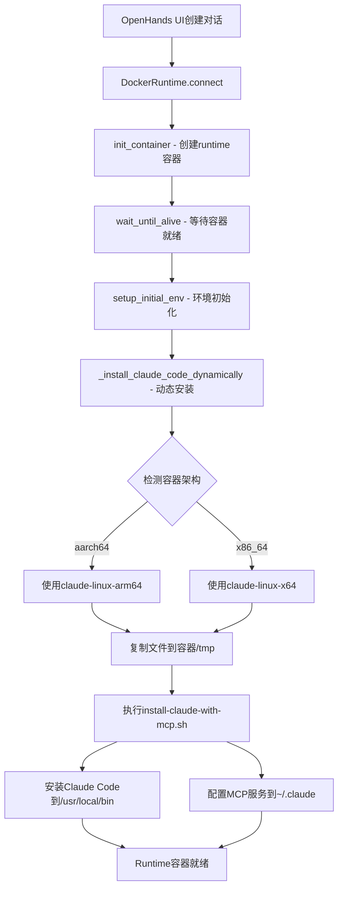

# Claude Code Runtime容器部署说明文档

## 📋 概述

本文档描述了如何在OpenHands runtime容器中动态部署Claude Code CLI和MCP服务的完整方案。该方案实现了在不修改基础镜像的前提下，每次runtime容器启动时自动安装Claude Code和相关配置。

## 🏗️ 系统架构

### 核心组件

```
OpenHands项目根目录/
├── claude-mcp-integration/           # Claude Code集成包
│   ├── claude-linux-arm64           # ARM64架构二进制文件
│   ├── claude-linux-x64             # x86-64架构二进制文件
│   ├── install-claude-with-mcp.sh   # 安装脚本
│   ├── mcp-config-template.json     # MCP服务配置模板
│   └── user-mcp-config.json         # 用户自定义配置模板
├── docker-compose.dev.yml           # 开发环境配置（已修改）
└── openhands/runtime/impl/docker/
    └── docker_runtime.py            # 运行时核心逻辑（已修改）
```

### 技术架构



## 🔧 工作流程

### 1. 容器启动阶段

1. **容器创建**: OpenHands创建新的runtime容器（基于`all-hands-ai/runtime:0.55-nikolaik`）
2. **架构检测**: 在容器内执行`uname -m`检测系统架构
3. **二进制选择**: 根据架构选择对应的Claude Code二进制文件
4. **文件复制**: 将claude-mcp-integration目录打包并复制到容器`/tmp`目录

### 2. 安装阶段

1. **执行安装脚本**: 运行`install-claude-with-mcp.sh`
2. **二进制安装**: 复制Claude Code到`/usr/local/bin/claude`并设置执行权限
3. **配置创建**: 创建Claude配置目录和MCP配置文件
4. **权限设置**: 为root和openhands用户配置相应权限
5. **清理工作**: 删除临时安装文件

### 3. 运行阶段

- Claude Code CLI已就绪，可通过`claude`命令调用
- MCP服务已预配置，支持filesystem、git、search等功能
- 支持用户自定义MCP服务扩展

## ⚙️ 架构支持

### 自动架构检测

安装脚本会自动检测容器架构并选择合适的二进制文件：

```bash
# 检测系统架构
ARCH=$(uname -m)
if [ "$ARCH" = "x86_64" ]; then
    CLAUDE_BINARY="claude-linux-x64"
elif [ "$ARCH" = "aarch64" ] || [ "$ARCH" = "arm64" ]; then
    CLAUDE_BINARY="claude-linux-arm64"
else
    echo "Unsupported architecture: $ARCH"
    exit 1
fi
```

### 支持的架构

| 架构 | 检测值 | 二进制文件 | 适用环境 |
|------|--------|------------|----------|
| x86-64 | `x86_64` | `claude-linux-x64` | Intel/AMD处理器 |
| ARM64 | `aarch64`, `arm64` | `claude-linux-arm64` | Apple Silicon, ARM服务器 |

## 📝 MCP服务配置

### 预配置服务

默认包含以下MCP服务：

```json
{
  "mcpServers": {
    "filesystem": {
      "command": "npx",
      "args": ["-y", "@modelcontextprotocol/server-filesystem", "/workspace"],
      "env": {}
    },
    "git": {
      "command": "npx", 
      "args": ["-y", "@modelcontextprotocol/server-git", "/workspace"],
      "env": {}
    },
    "brave-search": {
      "command": "npx",
      "args": ["-y", "@modelcontextprotocol/server-brave-search"],
      "env": {
        "BRAVE_API_KEY": "${BRAVE_API_KEY:-}"
      }
    },
    "github": {
      "command": "npx",
      "args": ["-y", "@modelcontextprotocol/server-github"],
      "env": {
        "GITHUB_PERSONAL_ACCESS_TOKEN": "${GITHUB_TOKEN:-}"
      }
    }
  }
}
```

### 服务功能说明

| 服务名 | 功能描述 | 环境变量要求 |
|--------|----------|--------------|
| `filesystem` | 文件系统访问，支持文件读写操作 | 无 |
| `git` | Git仓库操作，支持提交、分支等 | 无 |
| `brave-search` | Brave搜索引擎集成 | `BRAVE_API_KEY` |
| `github` | GitHub仓库集成 | `GITHUB_TOKEN` |

### 添加自定义MCP服务

1. **编辑用户配置模板**
   ```bash
   vim claude-mcp-integration/user-mcp-config.json
   ```

2. **添加新服务配置**
   ```json
   {
     "mcpServers": {
       "your-custom-service": {
         "command": "node",
         "args": ["/path/to/your/mcp-server.js"],
         "env": {
           "API_KEY": "${YOUR_API_KEY:-}",
           "DEBUG": "false"
         }
       }
     }
   }
   ```

3. **在容器中合并配置**
   ```bash
   # 在runtime容器中执行
   claude-mcp-config add-user-config
   ```

## 🚀 部署配置

### 1. 文件准备

确保以下文件存在：
```bash
claude-mcp-integration/
├── claude-linux-arm64      # 108MB，从官方下载
├── claude-linux-x64        # 115MB，从官方下载  
├── install-claude-with-mcp.sh  # 安装脚本
├── mcp-config-template.json    # MCP配置
└── user-mcp-config.json        # 用户配置
```

### 2. Docker Compose配置

在`docker-compose.dev.yml`中添加挂载：
```yaml
volumes:
  - ./claude-mcp-integration:/app/claude-mcp-integration
```

### 3. 运行时代码修改

在`openhands/runtime/impl/docker/docker_runtime.py`中添加：
```python
def setup_initial_env(self) -> None:
    """Setup initial environment including dynamic Claude Code installation."""
    super().setup_initial_env()
    
    if not self.attach_to_existing:
        try:
            self._install_claude_code_dynamically()
        except Exception as e:
            self.log('warning', f'Failed to install Claude Code dynamically: {e}')

def _install_claude_code_dynamically(self) -> None:
    """Dynamically install Claude Code in the running container."""
    # 实现动态安装逻辑
    pass
```

## 🎯 验证部署

### 验证Claude Code安装

```bash
# 检查Claude Code是否安装
docker exec <runtime_container_id> which claude
# 输出: /usr/local/bin/claude

# 检查版本
docker exec <runtime_container_id> claude --version
# 输出: 1.0.124 (Claude Code)
```

### 验证MCP配置

```bash
# 检查MCP配置文件
docker exec <runtime_container_id> cat /root/.claude/.mcp.json

# 检查配置目录
docker exec <runtime_container_id> ls -la /root/.claude/
```

### 验证架构检测

```bash
# 检查容器架构
docker exec <runtime_container_id> uname -m
# 输出: aarch64 或 x86_64

# 检查对应的二进制文件是否被使用
docker exec <runtime_container_id> file /usr/local/bin/claude
```

## 🔧 故障排除

### 常见问题

1. **Claude Code无法执行 - rosetta错误**
   - **原因**: 架构不匹配，使用了错误的二进制文件
   - **解决**: 检查`install-claude-with-mcp.sh`中的架构检测逻辑

2. **文件未找到错误**
   - **原因**: docker-compose挂载配置错误
   - **解决**: 确认`claude-mcp-integration`目录挂载到容器

3. **MCP服务不可用**
   - **原因**: 网络访问受限或API密钥未配置
   - **解决**: 配置相应的环境变量

### 调试命令

```bash
# 检查安装日志
docker logs <openhands_container> | grep -E "(Installing|Claude|Error)"

# 检查文件权限
docker exec <runtime_container_id> ls -la /usr/local/bin/claude

# 检查MCP配置有效性
docker exec <runtime_container_id> claude-mcp-config list
```

## 📊 性能优化

### 文件大小优化

- ARM64二进制: ~109MB
- x86-64二进制: ~116MB
- 总集成包大小: ~225MB
- 安装时间: ~3-5秒

### 缓存策略

- 利用Docker层缓存减少重复下载
- 在构建阶段预下载二进制文件
- 使用多阶段构建优化镜像大小

## 🔐 安全考虑

### 权限控制

- Claude Code以root权限安装
- 配置文件权限限制为用户可读
- 敏感信息通过环境变量传递

### 网络安全

- MCP服务仅在容器内网络中运行
- API密钥支持环境变量配置
- 支持代理配置用于内网环境

## 📈 扩展性

### 添加新架构支持

1. 下载新架构的Claude Code二进制文件
2. 在`install-claude-with-mcp.sh`中添加架构检测逻辑
3. 更新文档说明

### 集成其他工具

可以参考Claude Code的集成模式，添加其他开发工具：
- Docker CLI
- Kubernetes CLI  
- 其他AI工具

## 📋 维护清单

### 定期维护任务

- [ ] 更新Claude Code到最新版本
- [ ] 检查MCP服务配置有效性
- [ ] 更新文档和示例代码
- [ ] 测试新版本OpenHands的兼容性

### 版本管理

- 跟踪Claude Code版本发布
- 记录配置变更历史
- 维护向后兼容性

---

## 📞 联系信息

- **维护者**: OpenHands开发团队
- **更新日期**: 2025-09-25
- **版本**: 1.0.0
- **Claude Code版本**: 1.0.124

此文档详细记录了Claude Code runtime容器部署的完整方案，可作为部署、维护和故障排除的参考指南。